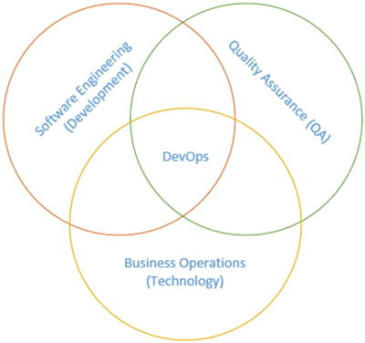
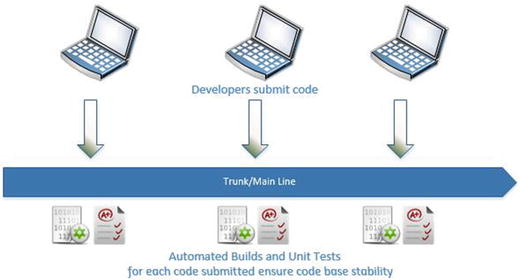
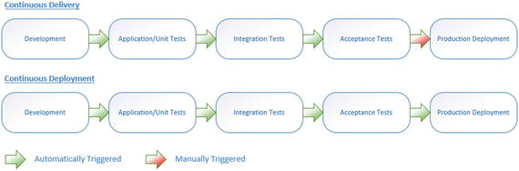
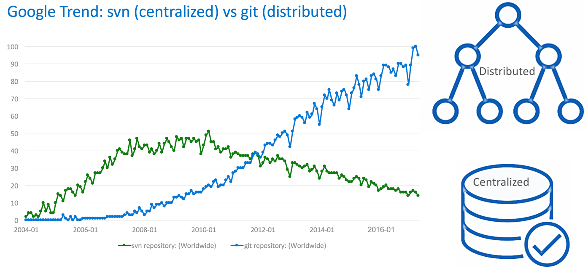
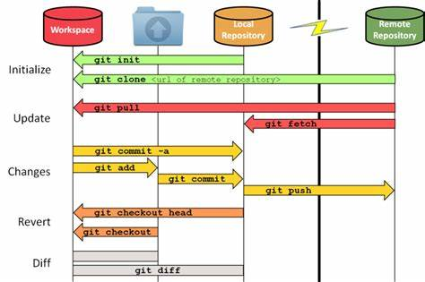
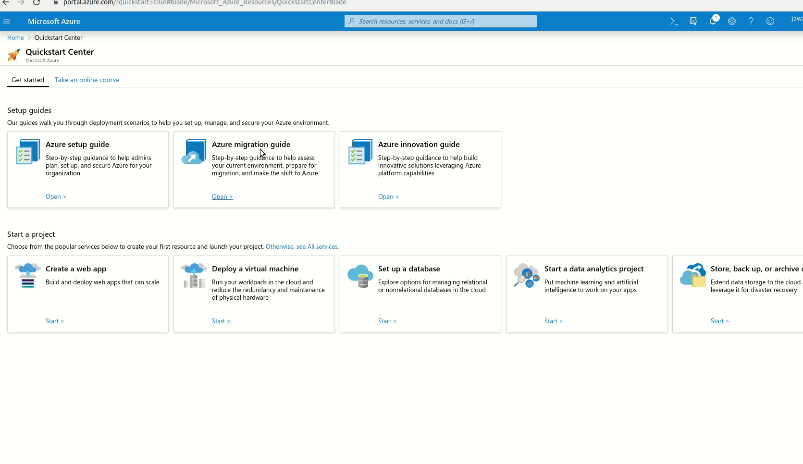
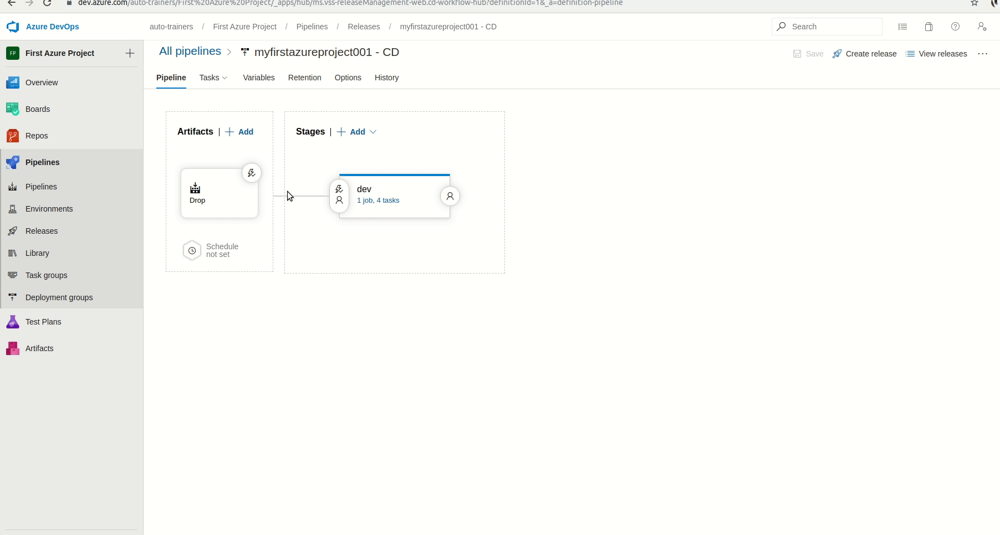
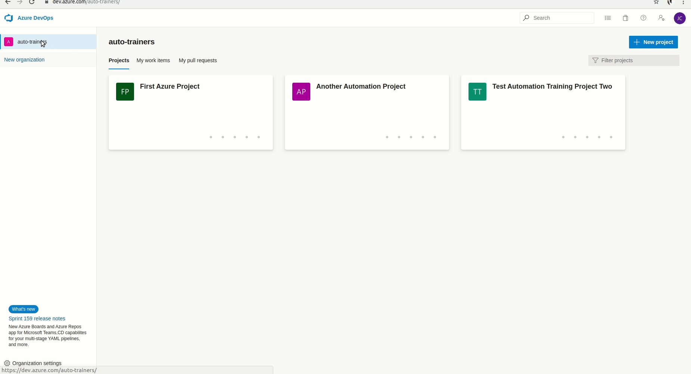

# CI/CD

## Some concepts

#### What is Devops

- A culture and the practice of an organization.
- Build, test, and release frequently and with reliability
- Requires automated delivery cycle and significant infrastructure changes



#### What is continuous

* Continuous Integration
  * Ensure source code stability
  * Build and unit test
  * Merge continuously, frequently, and minimally



* Continuous Delivery
  * Ensure every change can be deployed
  * Option to hold for any manual activity before production deployment
* Continuous Deployment
  * Deploy every change to production automatically



* Continuous Testing
  * Generating virtual services and test data
  * Test build promotion criteria
  * Test build configuration
  * Test environment provisioning
  * Test build deployments
  * Monitor and test Application monitoring
  * Capture and analyze test results data
  * Correlate results to past execution

* Manage and deploy A/B tests and canary builds for continuous releases

An Interesting periodic table of devops tools is provided [here](https://xebialabs.com/periodic-table-of-devops-tools/)

#### Git

Git is distributed repository in comparison to other version control solutions like SVN, TFVC. Here is an old report comparing their growth



##### Git stages

Git has three stages
* Working Directory (Untracked/ Unstaged)
* Staged
* Commit

We can then link the local repository with global repository (remote)



Following are a few commands that we looked at:

```bash
git init # initialize a git repository in current directory
git config user.email "your@email" # configure email for current git repository. You can use --global for making it global
git config user.name "Your Name" # configure user name for current git repository. You can use --global for making it global
git add . # Add all untracked/Unstaged changes to staged
git commit -m "Commit Message" # Add changes to local repository
git commit -am "Commit Message" # Add all unstaged changes and then add to local repository in single command
git log # See commit log history for current branch
git log --pretty=oneline # See the logs in single line with basic information
git branch # show all branches
git branch branch_name # create new branch
git checkout branch_name # Switch to new branch
git checkout -b branch_name # Switch to new branch and create if not already exists
git checkout -- . # Discard all unstaged changes
git reset HEAD # Reset staged changes
git reset HEAD~1 # Reset last commit
git reflogs # see branch logs
git reset 'HEAD@{4}' # Go back to reflog head 4
git stash # Push current working directory to stack
git stash list # To see stashed items
git stash pop # pull latest stashed changes
git remote add origin <ssh git url> # Link current local repository to remote repository under the name origin
git push -u origin --all # Push all branches and commits to remote named origin
git pull origin # to be able to pull changes from remote to local
```
https://github.blog/2015-06-08-how-to-undo-almost-anything-with-git/

#### Docker

##### [Container](https://www.docker.com/resources/what-container)
> A container is a standard unit of software that packages up code and all its dependencies so the application runs quickly and reliably from one computing environment to another.

> Container images become containers at runtime and in the case of Docker containers - images become containers when they run on Docker Engine. Available for both Linux and Windows-based applications, containerized software will always run the same, regardless of the infrastructure.

##### [Docker Concepts](https://docs.docker.com/get-started/)

> Docker is a platform for developers and sysadmins to build, share, and run applications with containers. The use of containers to deploy applications is called containerization. Containers are not new, but their use for easily deploying applications is.
Containerization is increasingly popular because containers are:
Flexible: Even the most complex applications can be containerized.
Lightweight: Containers leverage and share the host kernel, making them much more efficient in terms of system resources than virtual machines.
Portable: You can build locally, deploy to the cloud, and run anywhere.
Loosely coupled: Containers are highly self sufficient and encapsulated, allowing you to replace or upgrade one without disrupting others.
Scalable: You can increase and automatically distribute container replicas across a datacenter.
Secure: Containers apply aggressive constraints and isolations to processes without any configuration required on the part of the user.

[Here](https://www.freecodecamp.org/news/comprehensive-introductory-guide-to-docker-vms-and-containers-4e42a13ee103/) is a small helpful article to define and understand different docker terms

##### Docker Installation

Following are a couple of important links to get started with docker on windows

- https://docs.docker.com/docker-for-windows/install/
- https://docs.docker.com/docker-for-windows/

##### Exploring

In your terminal (Powershell), run a Ubuntu container and enter its bash

```
docker run -t -i ubuntu bash
```

In another terminal run command to see running container
```
docker ps
```

Make some changes and exit
```
mkdir some_directory
cd some_directory
touch some_file
exit
```

Run command to see stopped containers
```
docker ps -a
```

Commit the changes and tag the image
```
docker commit $(docker ps -lq) test-image
```

You can also view your images
```
docker images ls
```

Note that if you run the ubuntu image again then the folder and files you created above will not be available
```
$ docker run -t -i ubuntu bash
# ls
# exit
```

But if you run the image you created then you will see those files

```
$ docker run -t -i test-image bash
# ls
# ls some_directory
```

## Containerization of our project
For executing our workflows in containerized mode, we would like to run selenium in its own container while our workflows run in their own container. We can use pre-build selenium docker containers provided by selenium HQ [here](https://github.com/SeleniumHQ/docker-selenium). They can easily be run using commands as provided in [README](https://github.com/SeleniumHQ/docker-selenium#running-the-images)

For our workflows we will have to make some configuration changes

* In `package.json` add following as scripts to allow for executing tests in different modes
```
"scripts": {
  "test:local:chrome": "RUN_ENV=dev mocha ./tests/**/*",
  "test:local:firefox": "TARGET_BROWSER=firefox RUN_ENV=dev mocha ./tests/**/*",
  "test:ci": "RUN_ENV=ci mocha ./tests/**/*"
},
```

* In `nightwatch.json` add following environment settings
```
"ci" : {
    "webdriver" : {
      "default_path_prefix": "/wd/hub",
      "host": "selenium",
      "port": 4444
    },
    "desiredCapabilities": {
        "browserName": "chrome",
        "javascriptEnabled": true,
        "acceptSslCerts": true,
        "chromeOptions": {
          "w3c": false,
          "args": [
            "--headless"
          ]
        }
    }
}
```

* `nightwatch.conf.js` have also been updated to merge default and ci configurations as default for custom nightwatch runner
```

  if (process.env.RUN_ENV !== "ci") {
    setLocalRunSettings(settings);
  } else {
    settings.test_settings.default = Object.assign({}, settings.test_settings.default, settings.test_settings.ci)
  }
```

* Add a `Dockerfile` in root directory and add steps required to trigger our tests
  * Add `FROM node:10.17.0-stretch` to identify the starting point for our container. In this case its node 10.17.0 stretch. For other node version available you can look [here](https://hub.docker.com/_/node/)
  * Copy your code from current directory to container `COPY . /my_test_code`
    * To avoid copying unwanted content you can create `.dockerignore` file in root directory and specify which files/folders to skip
  * You can switch to your directory where you copied it using `WORKDIR /my_test_code`
  * You can expose the volumn for your reports as `VOLUME /my_test_code/reports`
  * Install your npm packages `RUN npm install --production`
  * Setup the entry point command for your tests
  `CMD ["npm", "run", "test:ci"]`

You can read more about docker file commands [here](https://docs.docker.com/engine/reference/builder/)

* Create a `docker-compose.yml` in root directory and add following to simplify container deployment
  * Define workflows service as follows:
  ```
  workflows:
    build: .
    env_file:
      - ./.env
    volumes:
      - "./reports:/my_test_code/reports"
    networks:
      internal:
        aliases:
          - workflows
  ```
  * Define selenium service as follows:
  ```
  selenium:
    image: "selenium/standalone-chrome:3.141.59-vanadium"
    ports:
      - 4444:4444
    volumes:
      - /dev/shm:/dev/shm
    networks:
        internal:
          aliases:
            - selenium
  ```
  * Set up `.env` file as explained in `.env.example` file to define values to be used by test data including url, api key, passwords.

  For more on docker compose file you can read [here](https://docs.docker.com/compose/compose-file/)

You can now run your tests using following command in your project root directory

```
docker-compose up --abort-on-container-exit
```

To only view workflow logs you can run following commands
```
docker-compose up -d
docker-compose logs -f workflows
```
On test completion you can clean up using

```
docker-compose down
```

For more on docker-compose cli you can read [here](https://docs.docker.com/compose/reference/overview/)


Note: you can still run tests locally using
```
npm run test:local:chrome
```
or
```
npm run test:local:firefox
```
Note: firefox one is a bit flacky. Did not yet had time to look at it.

The sample project is available [here](./Sample_Project)

## Setting up azure pipeline

#### Getting Started with Azure

You can signup for azure and get 200 USD and one year free (whichever runs out first).

After signup, let us start a quick project with ci/cd pipeline to explore possible features just to explore the project and its pipeline



After starting the project, it will process for a bit and deploy the required resources. You can navigate around to explore after the project is deployed


Also, explore the vNext build setup options


Then explore the vNext build steps for release and also view the unit and ui test results



#### Create a project for your code and setup a pipeline using YAML

##### Create project and push your code

Create a new Project in



In your current source code folder run, initialize git respository if not already done using
```
git init
git config user.email "your email address"
git config user.name "Jawad Cheema"
git add .
git commit -m "Initial Project"
```

If its already initialized then you can rename existing remote origin and point the origin to your newly created respository and push your code

```bash
git remote rename origin oldOrigin
git remote add origin git@ssh.dev.azure.com:v3/auto-trainers/New%20Automation%20Project/New%20Automation%20Project # this command is copied form the newly created project
git push -u origin --all
```

##### Add azure pipeline yaml file

Create a `azure-pipelines.yml` file and add following steps to it

You can read about yaml schema [here](https://docs.microsoft.com/en-us/azure/devops/pipelines/yaml-schema?view=azure-devops&tabs=schema)

* Docker task to login to acr
  ```yml
  - task: Docker@2
    displayName: Login to ACR
    inputs:
      command: login
      containerRegistry: dockerRegistryServiceConnection
  ```
  More info [here](https://docs.microsoft.com/en-us/azure/devops/pipelines/tasks/build/docker?view=azure-devops#login)

* Docker task to build and push
  ```yml
  - task: Docker@2
    displayName: Build and push an image to container registry
    inputs:
      command: buildAndPush
      repository: workflows
      containerRegistry: dockerRegistryServiceConnection
      tags: |
        latest
  ```
  More info [here](https://docs.microsoft.com/en-us/azure/devops/pipelines/tasks/build/docker?view=azure-devops#build-and-push)

* Docker compose task to run services
  ```yml
  - task: DockerCompose@0
    displayName: Run services
    inputs:
      action: Run services
      azureSubscriptionEndpoint: testService
      azureContainerRegistry: dockerRegistryServiceConnection
      dockerComposeFile: docker-compose-ci.yml
      projectName: $(Build.Repository.Name)
      qualifyImageNames: true
      abortOnContainerExit: true
      detached: false
      dockerComposeFileArgs: |
        LAUNCH_URL=$(LAUNCH_URL)
        BASE_URL=$(BASE_URL)
        API_KEY=$(API_KEY)
        SERVER_TOKEN=$(SERVER_TOKEN)
        USER_EMAIL=$(USER_EMAIL)
        USER_PASSWORD=$(USER_PASSWORD)
        USER_ID=$(USER_ID)
  ```
  More info [here](https://docs.microsoft.com/en-us/azure/devops/pipelines/tasks/build/docker-compose?view=azure-devops#run-service-images)

* Publish results task to publish results
  ```yml
  - task: PublishTestResults@2
    inputs:
      testResultsFormat: 'JUnit'
      testResultsFiles: '**/reports/test_results.xml'
      searchFolder: '$(System.DefaultWorkingDirectory)' # Optional
      mergeTestResults: false # Optional
      failTaskOnFailedTests: true # Optional
      # testRunTitle: # Optional
      # buildPlatform: # Optional
      # buildConfiguration: # Optional
      # publishRunAttachments: true # Optional
  ```
  More info [here](https://docs.microsoft.com/en-us/azure/devops/pipelines/tasks/test/publish-test-results?view=azure-devops&tabs=yaml#yaml-snippet)

##### Other required changes
* Add a docker-compose file for ci. Note the image path and url needs to be updated to point to your registery and repository
  ```yml
  version: '3.7'

  services:
    workflows:
      image: sampetodoacr.azurecr.io/workflows:latest
      volumes:
        - "./reports:/app/workflows/reports"
      environment:
        - LAUNCH_URL=${LAUNCH_URL}
        - BASE_URL=${BASE_URL}
        - API_KEY=${API_KEY}
        - SERVER_TOKEN=${SERVER_TOKEN}
        - USER_EMAIL=${USER_EMAIL}
        - USER_PASSWORD=${USER_PASSWORD}
        - USER_ID=${USER_ID}
      networks:
        internal:
          aliases:
            - workflows

    selenium:
      image: "selenium/standalone-chrome:3.141.59-vanadium"
      ports:
        - 4545:4444
      volumes:
        - /dev/shm:/dev/shm
      networks:
          internal:
            aliases:
              - selenium

  networks:
    internal:
  ```
* A few changes in package.json and mocharc.js to allow mocha to report in cli and junit report
  * add package `"mocha-multi": "1.1.3"``
  * add `--reporter-options dot=-,xunit=reports/test_results.xml` to mocha test run scripts in `package.json`
  * add `reporter: 'mocha-multi',` in `.mocharc.js`

* Associate required azure portal resources and point project to yaml file. Add environment variables


##### Run and observer
* Once the builds completes you can view the build details and test results


